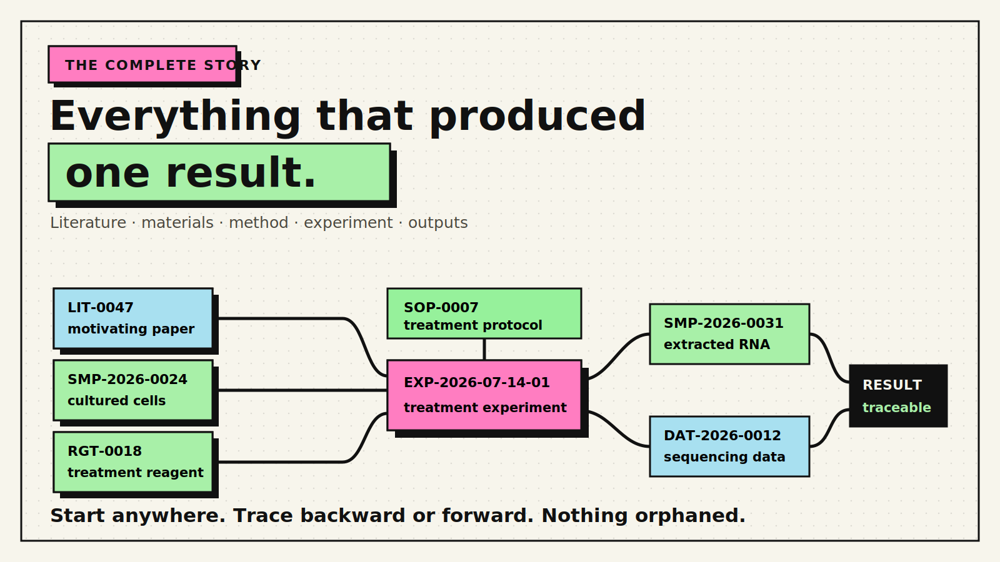
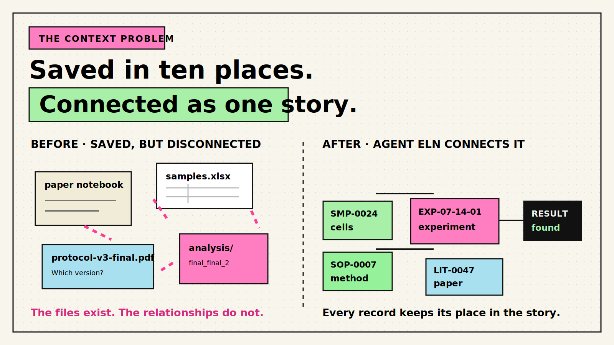
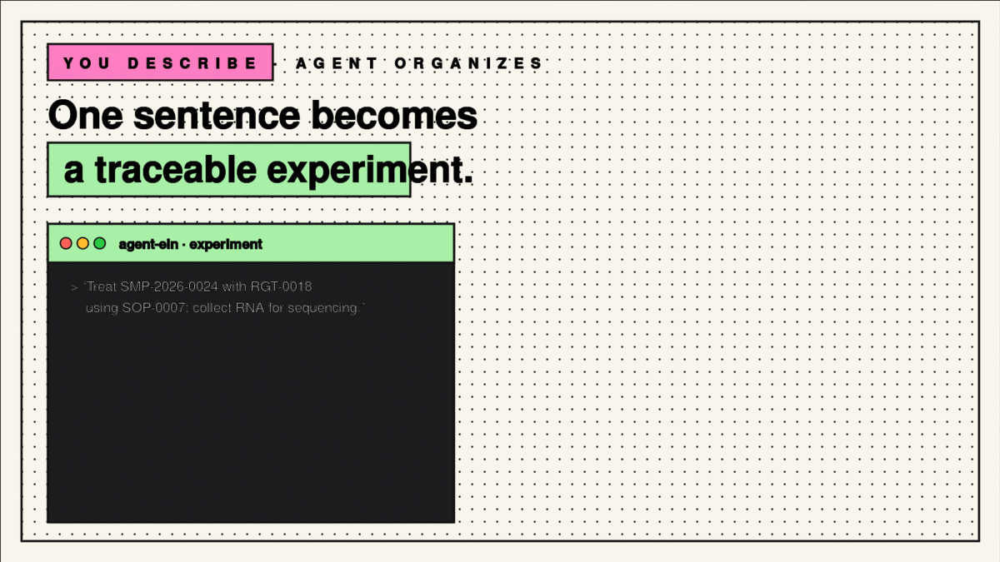
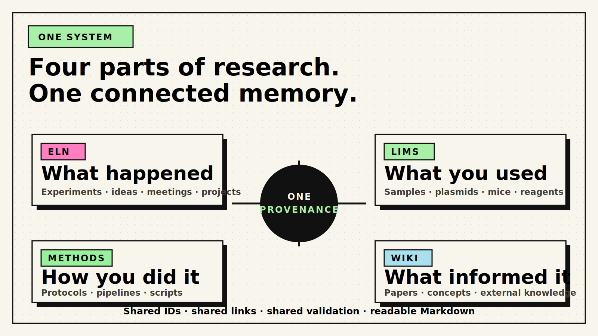
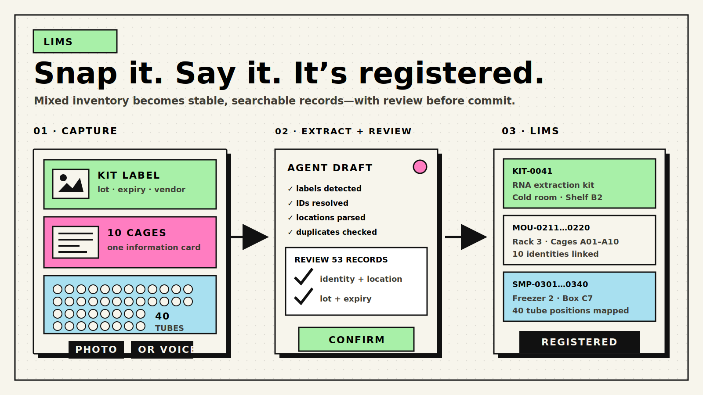
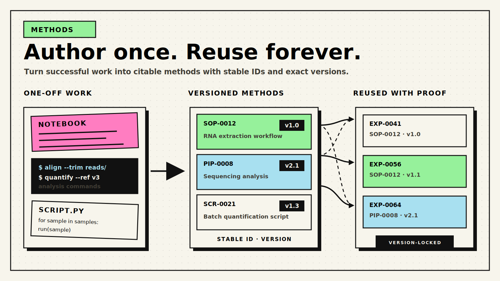
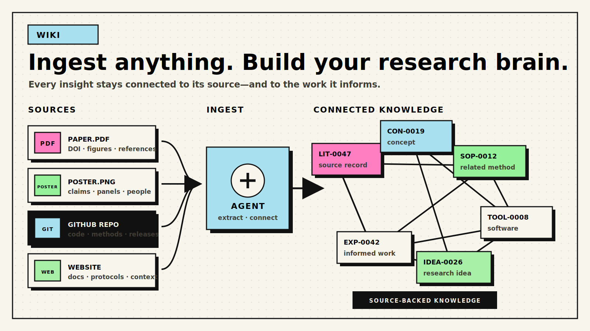

# Agent ELN

[](https://github.com/larrywei8/agent-eln/actions/workflows/tests.yml)
[](https://www.python.org/)
[](LICENSE)

## You remember the result. Agent ELN remembers everything that produced it.

**Never lose the story behind an experiment again.**

Agent ELN connects each experiment to the exact samples, plasmids, mice, reagents,
protocols, datasets, code, and papers behind it—while an AI agent handles the organizing.

Six months later, you can still trace any result back to what you used, what you did,
what you produced, and why.



## Your experiment is one story stored in ten different places

The notebook records what you did. A spreadsheet tracks sample names. Plasmid maps,
protocols, microscopy images, sequencing files, analysis code, and papers live in
different folders and applications.

Each part may be saved, but the relationships between them are easily lost. The result
may be memorable while the chain of evidence behind it gradually disappears.

Traditional electronic notebooks digitize the page. Agent ELN preserves the connected
story behind the result.



## From one sentence to a traceable experiment

Tell your AI agent:

> I treated cells from SMP-2026-0024 with RGT-0018 using SOP-0007, then collected RNA
> for sequencing.

Using Agent ELN's documented workflows and tools, the agent can:

1. Find the existing sample, reagent, and protocol.
2. Create a uniquely identified experiment.
3. Register newly produced samples and datasets.
4. Link every input, method, and output.
5. Check whether important context is missing or broken.
6. Refresh the searchable index and provenance graph.



You remain responsible for the science. The agent handles the repetitive organization
that makes the science recoverable.

```text
SMP-2026-0024 ─┐
RGT-0018 ──────┼──> EXP-2026-07-14-01 ──> SMP-2026-0031 ──> DAT-2026-0012
SOP-0007 ──────┘
        paper ──> idea ──> experiment ──> sample ──> dataset ──> result
```

Start from a result and trace backward to its origins. Start from a plasmid, mouse,
protocol, or paper and discover the experiments connected to it.

## One research system, four connected parts

| Module | The question it answers | Examples |
| --- | --- | --- |
| **ELN** | What happened? | Experiments, meetings, ideas, projects, literature |
| **LIMS** | What do I have and use? | Samples, plasmids, mice, reagents, cell lines, instruments |
| **Methods** | How did I do it? | Protocols, pipelines, scripts, reusable agent skills |
| **Wiki** | What have I learned? | Papers, concepts, entities, external knowledge |

All four use the same identifiers, links, validation tools, and provenance model. They
are not separate databases that need to be kept in sync by hand.



```text
agent-eln/
├── eln/       what happened
├── lims/      what you have and use
├── methods/   how you do it
├── wiki/      what you learned
├── tools/     creation, validation, indexing, and provenance
└── templates/ structured record templates
```

## Register inventory without data entry

### Snap it. Say it. It’s registered.

Photograph a kit label, mouse cage card, or rack of uniquely labeled tubes—or describe
the item directly to your agent. The agent can extract the details, resolve or assign
stable IDs, map locations, check for duplicates, and prepare the records for review
before registration.



## Turn successful work into reusable methods

### Author once. Reuse forever.

Turn a successful notebook workflow, analysis command sequence, or one-off script into a
versioned SOP, pipeline, or reusable script. Future experiments can cite the exact
method ID and version that produced their results.



## Build connected knowledge from any source

### Ingest anything. Build your research brain.

Bring in a paper, poster, GitHub repository, or website. Agent ELN can preserve the
source, organize the concepts, methods, tools, and ideas it contains, and connect that
knowledge to the experiments it informs.



## What this changes for you

### Reconstruct old experiments

Recover the materials, protocol version, data, code, and reasoning behind a result.

### Document without becoming a data-entry clerk

Describe the work naturally while an AI agent creates records, assigns stable IDs,
connects related materials and methods, and checks the result.

### Reuse successful work

Find every experiment that used a particular plasmid, mouse line, reagent, or protocol.
Trace samples and datasets through their ancestors and descendants.

### Preserve project continuity

Keep experimental reasoning intact for your future self, collaborators, and the next
researcher who inherits the project.

### Own your research record

Store the system as readable Markdown and Git history instead of locking it inside a
proprietary platform.

## Why Agent ELN is different

### Built for scientists and AI agents

Every record combines structured YAML frontmatter with readable Markdown. A scientist
can understand it directly; an agent can create, connect, query, and validate it through
stable documented contracts.

### Provenance instead of isolated pages

Experiments declare the resources and methods they used and the samples and datasets
they produced. Backlinks and a machine-readable graph make those relationships
navigable in both directions.

### Plain files instead of platform lock-in

There is no required database server, hosted account, or proprietary file format. Core
operations use Python's standard library; optional features add DuckDB, PDF extraction,
and YAML support.

### Git as the scientific timeline

Each commit can preserve a reviewable snapshot of the connected research record. Earlier
versions remain recoverable, and a private remote can provide synchronization and backup.

### Quality checks are built in

Agent ELN detects malformed records, broken references, stale derived indexes, duplicate
identifiers, provenance problems, and literature/wiki inconsistencies. Agent-facing
commands provide structured JSON findings with suggested corrections when available.

## See the provenance, not just the files

The generated HTML dashboard and indexes turn the Markdown records into several views
without creating a second source of truth:

- a searchable, filterable record table;
- an interactive provenance graph;
- recent records, unread literature, and expiring resources;
- per-type CSV tables for spreadsheets;
- a DuckDB database for SQL queries when DuckDB is installed; and
- machine-readable JSON for agents and automations.

Run `python tools/dashboard.py`, then open `index/dashboard.html` locally.

## Quick start

```bash
git clone https://github.com/larrywei8/agent-eln.git
cd agent-eln

# Optional dependencies; core record operations use the Python standard library.
python -m pip install -r requirements.txt

bash tools/install-hooks.sh

# Create two records.
python tools/new.py plasmid --name "pAAV-CAG-EGFP"
python tools/new.py experiment --title "Cloning test"

# Build relationships, indexes, checks, and the dashboard.
python tools/backlinks.py --write
python tools/index.py
python tools/validate.py
python tools/dashboard.py
```

Read [`AGENT.md`](AGENT.md) next. It is the end-to-end operating manual for any AI
agent—or researcher—entering the repository.

For development, install `requirements-dev.txt` and run the test suite:

```bash
python -m pip install -r requirements.txt -r requirements-dev.txt
pytest tools/tests/ -v
```

## Common workflows

| Goal | Command |
| --- | --- |
| Preview a new record | `python tools/new.py <type> --name "..." --dry-run` |
| Create a derived sample | `python tools/derive.py <PARENT-ID> <CODE> <N>` |
| Trace ancestors and descendants | `python tools/trace.py <ID>` |
| Validate records | `python tools/validate.py` |
| Get structured validation findings | `python tools/validate.py --json` |
| Run non-blocking quality checks | `python tools/health.py` |
| Repair provenance backlinks | `python tools/backlinks.py --write` |
| Check generated indexes without changing files | `python tools/index.py --check` |
| Import a paper by DOI | `python tools/lit_from_doi.py <DOI>` |
| Synchronize literature and wiki links | `python tools/wiki_sync.py --fix` |
| Register a vendor or instrument delivery | `python tools/ingest.py <folder> ...` |
| Verify file hashes in a data manifest | `python tools/verify_data.py <manifest.csv>` |
| Query the generated DuckDB index | `python tools/query.py "SELECT ..."` |

Agent ELN currently defines 26 record types covering research activities, resources,
methods, literature, and knowledge. Run `python tools/registry.py table` for the
authoritative list of types, prefixes, ID styles, and folders.

## Why Markdown and Git?

The file system is intentionally the source of truth:

- records remain readable and editable without specialized software;
- AI agents can operate them through stable structures and documented procedures;
- Git records how the research state changes over time;
- ordinary search, scripts, and analysis tools continue to work;
- large raw data can stay on a NAS or external store while manifests preserve paths,
  sizes, and hashes; and
- the system remains usable if an interface, service, or vendor disappears.

The generated CSV, JSON, DuckDB, and HTML outputs are disposable views. Rebuild them
from the Markdown source whenever needed.

## Reliability and reproducibility

Agent ELN includes:

- stable, never-reused record identifiers;
- a centralized registry for record types and required fields;
- schema and cross-reference validation;
- idempotent backlink generation and repair;
- non-mutating stale-index detection;
- DOI deduplication and bidirectional literature/wiki synchronization;
- compound sample IDs plus explicit derivation relationships;
- data manifests and hash verification for external raw files;
- optional protocol versions, code commits, environment lockfiles, and output manifests;
- structured JSON contracts for agent workflows; and
- continuous integration on Python 3.11 and 3.12.

The Git pre-commit hook rebuilds indexes and blocks commits when structural validation
fails. Softer completeness findings remain visible through the health report without
preventing work in progress.

## Configuration

The tools work with sensible defaults. Environment-specific values can be customized
without adding personal information to the repository:

| Variable | Purpose | Default |
| --- | --- | --- |
| `AGENT_ELN_USER` | Default author for `--by` flags | `$USER` |
| `AGENT_ELN_CONTACT_EMAIL` | Contact for Crossref and external APIs | `agent-eln@example.org` |
| `AGENT_ELN_WIKI_URL_PREFIX` | URL prefix for links into your wiki | empty; use plain paths |
| `AGENT_ELN_REPO_ROOT` | Override the auto-detected repository root | auto-detected |

## Scope

Agent ELN is designed for individual researchers and small research groups that value
traceability, reproducibility, AI assistance, and ownership of their records. It supports
mixed wet-lab and computational research without requiring administration of an
enterprise platform.

It is **not** a regulated or GxP-compliant LIMS. It does not provide electronic
signatures, approval workflows, immutable compliance controls, or high-concurrency
inventory transactions. See [`ROADMAP.md`](ROADMAP.md) for the project's deliberate
scope and current direction.

## Documentation

| Document | Purpose |
| --- | --- |
| [`AGENT.md`](AGENT.md) | Complete operating manual and command reference |
| [`eln/AGENTS.md`](eln/AGENTS.md) | Experiments and research activities |
| [`lims/AGENTS.md`](lims/AGENTS.md) | Resources and lightweight inventory |
| [`methods/AGENTS.md`](methods/AGENTS.md) | Protocols, pipelines, scripts, and skills |
| [`wiki/AGENTS.md`](wiki/AGENTS.md) | Literature and research knowledge |
| [`conventions.md`](conventions.md) | Identifiers, naming, and record conventions |
| [`hierarchy.md`](hierarchy.md) | Derived samples and compound identifiers |
| [`vocab.md`](vocab.md) | Optional controlled vocabulary |
| [`CONTRIBUTING.md`](CONTRIBUTING.md) | Development and contribution guide |
| [`ROADMAP.md`](ROADMAP.md) | Scope, completed work, and planned improvements |

## Contributing

Agent ELN is for researchers who want to spend less time reconstructing their work and
more time using it. If you believe scientific tools should be open, agent-operable, and
owned by researchers, try the system on a real project and share what breaks or feels
unnecessarily difficult.

Issues and pull requests are welcome. See [`CONTRIBUTING.md`](CONTRIBUTING.md) before
submitting a change.

## License

Agent ELN is available under the [MIT License](LICENSE).
